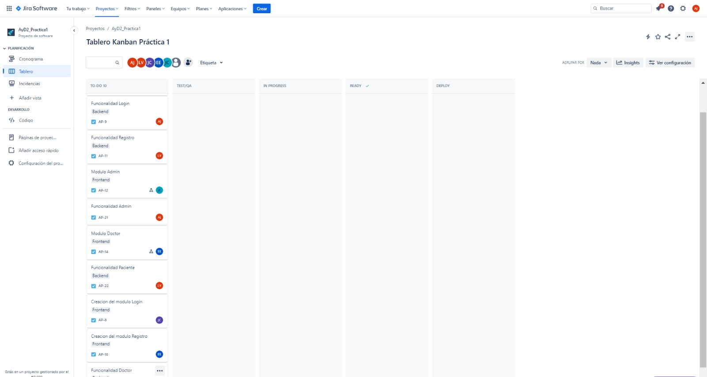
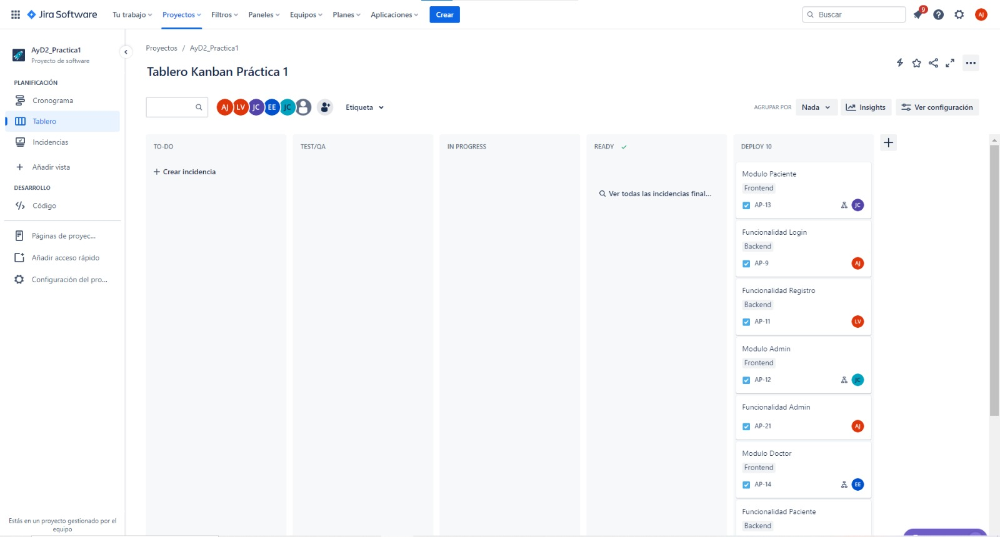

# Proyecto 1 Fase 1 Grupo 4 AyD2

# Documentación Sprint #1

* Esteban Humberto Valdez Ennati        - 202011535
* Luis Angel Barrera Velásquez          - 202010223
* Josué Rodolfo Morales Castillo        - 202010033
* Ayeser Cristian Oxlaj Juarez          - 202010025
* Juan Pablo García Ceballos            - 201901598

- ## Daily´s Scrum Sprint 1
    - ### Día 1 (04/02/2024)
        - Esteban Valdez: Creación del tablero kanban y agregar tareas a realizar.
        - Angel Barrera: Analizar funcionalidades que se deben implementar para agregarlas al kanban.
        - Rodolfo Morales: Asignar qué tarea debe hacer cada miembro del equipo.
        - Ayeser Oxlaj: Realizar historias de usuario de funcionalidades del backend.
        - Pablo García: Realizar historias de usuario de funcionalidades del frontend.

    - ### Día 2 (05/02/2024)
        - Esteban Valdez: Planear qué biblioteca usar para el diseño de la aplicación.
        - Angel Barrera: planificar qué base de datos usar (mysql o sqlserver)
        - Rodolfo Morales: Planear qué tecnología se usará para la creación del frontend.
        - Ayeser Oxlaj: Investigación sobre posibles patrones de diseño a implementar en el proyecto. Por el momento el único patrón de diseño que se definió que si sé usara será el Patrón de Diseño Singleton. Lo único que aún no se definió fue en que parte del proyecto sé usará.
        - Pablo García: Planificación diseño de pantalla admin.

    - ### Día 3 (06/02/2024)
        - Esteban Valdez: Creación de repositorio y ramas.
        - Angel Barrera: planificar qué base de datos usar (local o nube)
        - Rodolfo Morales: Creación proyecto en react y subir la creación inicial a la rama develop.
        - Ayeser Oxlaj: Investigación de otro posible patrón de diseño a implementar, en este caso se investigó sobre el Patrón de diseño abstracto. Además se definió que se usará nodejs para la implementación del backend.
        - Pablo García: Planificación y diseño de pantalla admin.

    - ### Día 4 (07/02/2024)
        - Esteban Valdez: Planificación y diseño pantalla Sign Up.
        - Angel Barrera: investigacion de como crear una base de datos en aws RDS
        - Rodolfo Morales: Planificación y diseño pantalla Login.
        - Ayeser Oxlaj: Creación de la estructura del proyecto, se realizó la estructura de las carpetas que tendrá el backend, esto con el fin de poder trabajar de forma ordenada.
        - Pablo García: Planificación y diseño de pantalla admin.

    - ### Día 5 (08/02/2024)
        - Esteban Valdez: Establecer la estructura JSON para la información enviada y recibida a través de la API destinada a la pantalla Sign Up.
        - Angel Barrera:Intento de creación de la base de datos en AWS RDS
        - Rodolfo Morales: Establecer la estructura JSON para la información enviada y recibida a través de la API destinada a la pantalla Login.
        - Ayeser Oxlaj: Creación de la API en nodejs, se empezó solo implementado un EndPoint con un “Hola mundo”, para ver el correcto funcionamiento de la API. Se decidió usar el puerto 5000.
        - Pablo García: Establecer la estructura JSON para la información enviada y recibida a través de la API destinada a la pantalla de carga de doctores.

    - ### Día 6 (12/02/2024)
        - Esteban Valdez: Establecer la estructura JSON para la información enviada y recibida a través de la API destinada a la pantalla de resetear password.
        - Angel Barrera:Solución de error de conexión de base de datos y creación de tablas.
        - Rodolfo Morales: Establecer la estructura JSON para la información enviada y recibida a través de la API destinada a la pantalla contraseña olvidada.
        - Ayeser Oxlaj: Se decidió utilizar el patrón Singleton para realizar la conexión con la base de datos, esto para tener una sola conexión y no realizar múltiples conexiones. Ya se implementó en código para poder realizar las peticiones. 
        - Pablo García: Establecer la estructura JSON para la información enviada y recibida a través de la API destinada a la pantalla de eliminar doctor.

    - ### Día 7 (13/02/2024)
        - Esteban Valdez: Selección de imágenes para el login y sign up con temática de hospital.
        - Angel Barrera: ver tema de como encriptar.
        - Rodolfo Morales: Creación del logo del hospital.
        - Ayeser Oxlaj: Se investigó sobre cómo utilizar AWS Cognito para la recuperación de la contraseña. Además de ver si algún integrante del equipo contaba con una cuenta para usar el servicio.
        - Pablo García: Establecer la estructura JSON para la información enviada y recibida a través de la API destinada a la pantalla de eliminar usuario.

    - ### Día 8 (14/02/2024)
        - Esteban Valdez:  Creación inicial sign up usando imágen con temática de hospital y haciendo uso del logo.
        - Angel Barrera: resolución de problemas de encriptación y puesta de clave desde el .env
        - Rodolfo Morales: Creación inicial login usando imágen con temática de hospital y haciendo uso del logo.
        - Ayeser Oxlaj: Creación del EndPoint para hacer login y además se implementó la función de cognito, esto para obtener las credenciales del usuario desde AWS Cognito.
        - Pablo García: Establecer la estructura JSON para la información enviada y recibida a través de la API destinada a la pantalla de ingresar producto.

    - ### Día 9 (15/02/2024)
        - Esteban Valdez: Creación de un form el cual solicite los campos necesarios para realizar sign up.
        - Angel Barrera: realización del endpoint registro y guardado de contraseña encriptada en base de datos.
        - Rodolfo Morales: Creación de un form el cual solicite los campos necesarios para realizar login.
        - Ayeser Oxlaj: Se implementó la función cognito para el registro de usuario, esto para que en AWS almacenaremos los usuarios creados en la base de datos. Esto con el fin de poder realizar la recuperación de la contraseña.
      - Pablo García: Establecer la estructura JSON para la información enviada y recibida a través de la API destinada a la pantalla de carga de productos.

    - ### Día 10 (16/02/2024)
        - Esteban Valdez: Implementación botón Sign up con su respectiva funcionalidad, y redirección hacia login en caso ya se cuente con una cuenta.
        - Angel Barrera: toma de requerimientos para endpoints de citas
        - Rodolfo Morales: Implementación botón Login con su respectiva funcionalidad, y redirección hacia Sign up en caso no se cuente con una cuenta.
        - Ayeser Oxlaj: Se implementó la recuperación de la contraseña, esto utilizando cognito, hubieron algunos conflictos debido a la configuración que se realizó en el grupo de usuario de cognito, pero finalmente se logró implementar de forma exitosa. 
        - Pablo García: Evaluación de librería para el procesamiento de archivos con formato csv.

    - ### Día 11 (19/02/2024)
        - Esteban Valdez: Validación del correcto funcionamiento entre backend y frontend para realizar Sign up.
        - Angel Barrera: Investigación de los patrones de diseño de Builder y Strategy
        - Rodolfo Morales: Validación del correcto funcionamiento entre backend y frontend para realizar Login.
        - Ayeser Oxlaj: Se implementaron dos EndPoints, uno llamado “getPaciente” y “getDoctor”, esto para enviar al frontend los datos de todos los pacientes y doctores registrados en el sistema.
        - Pablo García: Pruebas del funcionamiento de la librería escogida para el procesamiento de datos que estén en archivos csv.

    - ### Día 12 (20/02/2024)
        - Esteban Valdez: Creación de pantalla emergente para resetear password.
        - Angel Barrera:endpoint addCitas y getCitas con patrón de diseño strategy
        - Rodolfo Morales: Creación de pantalla contraseña olvidada.
        - Ayeser Oxlaj: Se investigó sobre cómo usar S3 para almacenar imágenes, esto con el fin de que los productos del hospital tengan una ilustración. Además se intentó hacer la conexión con el backend, pero no se logro. 
        - Pablo García: Implementación de la librería escogida para el procesamiento de datos de archivos csv,  mostrando los datos en una tabla en la pantalla Cargar doctores.

    - ### Día 13 (21/02/2024)
        - Esteban Valdez: Validación del correcto funcionamiento entre backend y frontend para realizar reseteo de password.
        - Angel Barrera: endpoint cancelCitas del lado del paciente con patrón de diseño strategy
        - Rodolfo Morales: Validación del correcto funcionamiento entre backend y frontend para realizar contraseña olvidada.
        - Ayeser Oxlaj: Se logró hacer la conexión con S3 para el almacenamiento de la imagen, además se inició con la creación del EndPoint “guardarProducto”, esto para almacenar los productos. 
        - Pablo García:

    - ### Día 14 (22/02/2024)
        - Esteban Valdez: Planificación del diseño de la pantalla home de doctores.
        - Angel Barrera: endpoint getCitasEsperando que muestra que citas están pendientes de atender con patrón de diseño strategy
        - Rodolfo Morales: Planificación del diseño de la pantalla home de pacientes.
        - Ayeser Oxlaj: Se creó la función “saveImage” esto para guardar las imagenes en AWS S3 y obtener el link de la imagen para poder mostrarlo en el frontend. Además se termino el EndPoint “guardarProducto”.
        - Pablo García: Aplicar diseño y estilo a la pantalla Cargar doctores, incluyendo tabla y botones.

    - ### Día 15 (23/02/2024)
        - Esteban Valdez: Planificación del diseño de la pantalla home de doctores, incluyendo las funcionalidades que esta tendrá.
        - Angel Barrera: endpoint getCitasDoctor que muestra que citas están doctor de atender con patrón de diseño strategy
        - Rodolfo Morales: Planificación del diseño de la pantalla home de pacientes, incluyendo las funcionalidades que esta tendrá.
        - Ayeser Oxlaj: Se corrigieron errores de los EndPoints, ademá se inició a implementar el EndPoint “uploadCSV”, esto para hacer la carga masiva de doctores al sistema. Sin embargo, hubo un problema que cognito llegó a su máximo registro de usuarios diarios, por lo cual no se lograron terminar de hacer las pruebas del correcto funcionamiento del EndPoint.
        - Pablo García: Planteamiento de cómo eliminar doctores desde una tabla de acuerdo a la estructura json establecida.

- ## Tabla Sprint Backlog
| Tarea                                                    | Estado         | Justificación (si no se completó)                                               |
| -------------------------------------------------------- | -------------- | -------------------------------------------------------------------------------- |
| Creación del tablero Kanban                               | Completado     | -                                                                              |
| Análisis de funcionalidades                               | Completado     | -                                                                              |
| Asignación de tareas                                      | Completado     | -                                                                              |
| Creación de historias de usuario de funcionalidades       | Completado     | -                                                                              |
| Planificación de bibliotecas y tecnologías                | En progreso    | Pendiente de completar la planificación de bibliotecas y tecnologías para el frontend y backend. |
| Creación de repositorio y ramas                           | Completado     | -                                                                              |
| Investigación de patrones de diseño                       | Completado     | -                                                                              |
| Creación de la estructura del proyecto                    | Completado     | -                                                                              |
| Implementación de Endpoints en Node.js                    | En progreso    | Se ha comenzado con la implementación de un "Hola mundo", pero aún en progreso. |
| Establecer estructura JSON para la API                    | En progreso    | Se ha trabajado en algunas pantallas, pero aún en progreso.                      |
| Planificación y diseño de pantallas                       | En progreso    | La planificación y diseño de algunas pantallas aún está en progreso.             |
| Investigación sobre uso de AWS Cognito                    | En progreso    | La investigación está en progreso y no se ha completado completamente.           |
| Implementación de recuperación de contraseña              | Completado     | Aunque hubo conflictos en la configuración de Cognito, se logró implementar con éxito. |
| Evaluación de librería para procesamiento de archivos CSV  | En progreso    | Se han realizado pruebas, pero aún no se ha completado la evaluación.             |
| Validación del funcionamiento de backend y frontend para Sign Up | En progreso | La validación está en curso y no se ha completado completamente.                  |
| Investigación de patrones de diseño de Builder y Strategy  | En progreso    | La investigación está en curso y no se ha completado completamente.              |
| Implementación de Endpoints "getPaciente" y "getDoctor"    | En progreso    | Aunque se han implementado, aún se están ajustando y probando.                    |
| Creación de pantallas de reseteo y contraseña olvidada     | Completado     | -                                                                              |
| Conexión con AWS S3 para almacenamiento de imágenes       | En progreso    | Aunque se ha logrado la conexión, aún se está trabajando en la implementación completa. |
| Creación de pantallas "Sign Up" e "Ingresar Producto"     | En progreso    | Se está trabajando en la implementación de estas pantallas.                        |
| Implementación de recuperación de contraseña usando Cognito | Completado  | Aunque hubo conflictos en la configuración de Cognito, se logró implementar con éxito. |
| Validación del funcionamiento de backend y frontend para reseteo de contraseña | En progreso | La validación está en curso y no se ha completado completamente.                  |
| Investigación sobre cómo usar AWS S3 para almacenar imágenes | En progreso | La investigación está en curso y no se ha completado completamente.              |
| Planificación y diseño de pantalla "Home de Doctores"      | En progreso    | La planificación y diseño aún está en progreso.                                   |
| Implementación de Endpoints "getCitasEsperando" y "getCitasDoctor" | En progreso | Aunque se han implementado, aún se están ajustando y probando.                    |
| Creación de función "saveImage" para almacenar imágenes en AWS S3 | En progreso | Se ha creado la función, pero aún se está trabajando en la implementación completa. |
| Creación de EndPoint "uploadCSV" para carga masiva de doctores | En progreso | Se ha logrado, pero aún se están realizando pruebas y ajustes.                    |

- ## Tablero previo al inicio del sprint: 

- ## Tablero al final del sprint

- ## Sprint planning
    - Frontend: Para este primer sprint se planteará qué tecnologías, librerías y bibliotecas se usarán, además se diseñarán las pantallas para el módulo Admin, también la pantalla Login, Sign up, Contraseña olvidada, resetear contraseña y el inicio de la pantalla home para el módulo doctor y paciente.
    - Backend: Para este primer sprint se implementarán los 3 patrones de diseño solictados, además de la creación del modelo de la base de datos, la implementación de distintas tecnologías de aws, la encripatción de password, también el comienzo de endpoints para login, sign up, recuperación de contraseña y unas cargas en admin.

- ## Sprint Retrospective
| Nombre | Esteban Valdez |
|----------|----------|
| *¿Qué se hizo bien durante el Sprint?* | Fue genial organizar las tareas con kanban, pero creo que deberíamos mejorar en cumplir los plazos. |
| *¿Qué se hizo mal durante el Sprint?* | A veces nos retrasamos un poco con la implementación, algo en lo que todos podríamos trabajar. |
| *¿Qué mejoras se deben implementar para el próximo sprint?* | Quizás deberíamos ser más estrictos con el tiempo de implementación para mantenernos en el camino. |

| Nombre | Angel Barrera |
|----------|----------|
| *¿Qué se hizo bien durante el Sprint?* | Logramos resolver problemas de encriptación y estoy emocionado por investigar más sobre patrones de diseño. |
| *¿Qué se hizo mal durante el Sprint?* | AWS RDS nos causó algunos dolores de cabeza, así que podríamos profundizar en eso. |
| *¿Qué mejoras se deben implementar para el próximo sprint?* | Tal vez enfocarnos más en entender y solucionar problemas con AWS. |

| Nombre | Rodolfo Morales |
|----------|----------|
| *¿Qué se hizo bien durante el Sprint?* | Me encantó liderar la asignación de tareas, pero admito que nos retrasamos un poco. |
| *¿Qué se hizo mal durante el Sprint?* | Necesitamos mejorar en la ejecución de tareas, para no perder tiempo. |
| *¿Qué mejoras se deben implementar para el próximo sprint?* | Vamos a trabajar en ser más eficientes con nuestro tiempo.|

| Nombre | Ayeser Oxlaj |
|----------|----------|
| *¿Qué se hizo bien durante el Sprint?* | Logramos implementar el EndPoint "uploadCSV", lo cual fue genial. |
| *¿Qué se hizo mal durante el Sprint?* | AWS Cognito y S3 nos dieron algunos problemas, deberíamos profundizar en esos temas. |
| *¿Qué mejoras se deben implementar para el próximo sprint?* | Reforzar nuestra comprensión de la configuración de servicios de AWS. |

| Nombre | Pablo García |
|----------|----------|
| *¿Qué se hizo bien durante el Sprint?* | Contribuí evaluando librerías y estilos, pero tuve algunos problemas con la librería CSV. |
| *¿Qué se hizo mal durante el Sprint?* | La librería CSV fue un dolor de cabeza, creo que necesito entenderla mejor. |
| *¿Qué mejoras se deben implementar para el próximo sprint?* | Necesito profundizar en la comprensión de las librerías que utilizamos y gestionar mejor los problemas que puedan surgir. |

- ## Grabacioens daily's scrum
    - https://drive.google.com/drive/u/0/folders/1ZqpQmqDh3WW8HryX_PnyA4MU-3Fj8EZq