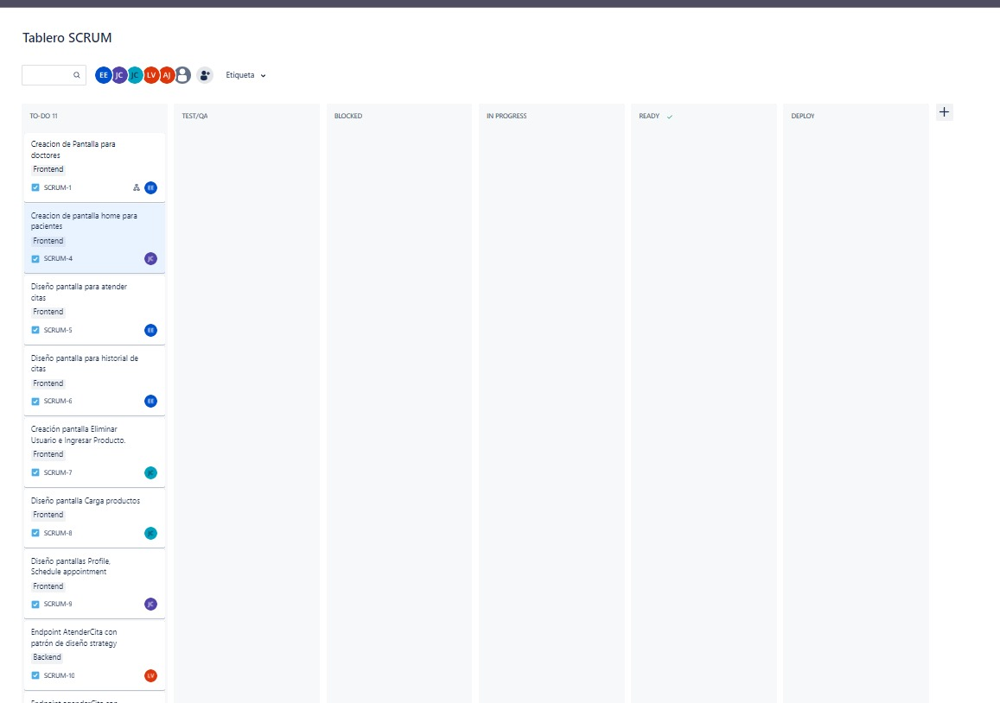
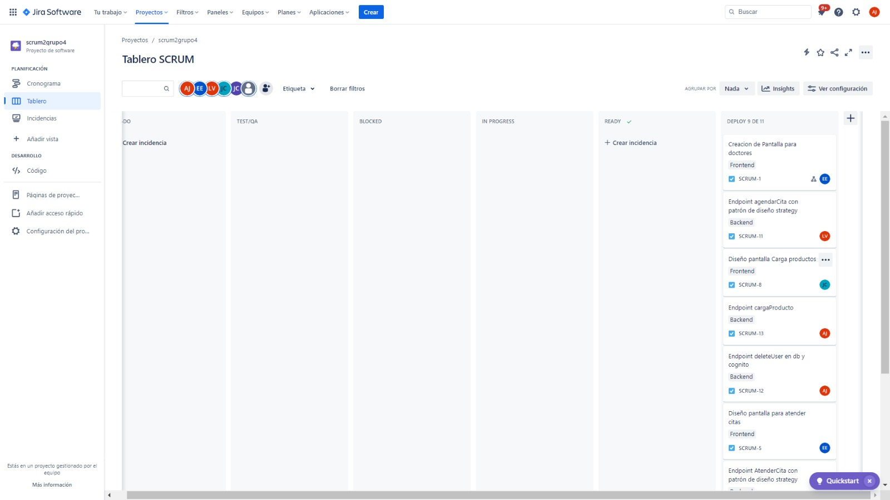

# Proyecto 1 Fase 1 Grupo 4 AyD2

# Documentación Sprint #2

* Esteban Humberto Valdez Ennati        - 202011535
* Luis Angel Barrera Velásquez          - 202010223
* Josué Rodolfo Morales Castillo        - 202010033
* Ayeser Cristian Oxlaj Juarez          - 202010025
* Juan Pablo García Ceballos            - 201901598

 - ## Daily´s Scrum Sprint 2
    - ### Día 1 (27/02/2024)
        - Esteban Valdez: Creación pantalla home para doctores.
        - Angel Barrera: endpoint AtenderCita que confirma la hora al usuario con patrón de diseño strategy
        - Rodolfo Morales: Creación pantalla home para pacientes.
        - Ayeser Oxlaj: Se logró terminar con éxito el EndPonit “uploadCSV”, esto para la carga masiva de doctores. Se inició con el EndPoint “deleteUser”, esto para eliminar un paciente o doctor, sin embargo, hubieron errores y no se logró terminar.
        - Pablo García: Eliminación de doctores, usando el endpoint brindado de parte del backend.

    - ### Día 2 (28/02/2024)
        - Esteban Valdez: Planificación y diseño pantalla Atender citas y pantalla Historial de Citas.
        - Angel Barrera: endpoint getProductos que muestra los productos registrados en la base de datos  con patrón de diseño strategy
        - Rodolfo Morales: Planificación y diseño pantalla Profile, Schedule appointment, Buy products, Appointment history
        - Ayeser Oxlaj: Se logró terminar el EndPoint “deleteUser”, se lograron resolver los problemas creando un usuario IAM en AWS, para obtener permisos de eliminación de usuarios. 
        - Pablo García: Creación pantalla Eliminar Usuario e Ingresar Producto.

    - ### Día 3 (29/02/2024)
        - Esteban Valdez: Creación pantallas Atender Citas e Historial de Citas.
        - Angel Barrera: endpoint agendarCita que muestra que citas están paciente de atender y se le asigna hora con patrón de diseño strategy
        - Rodolfo Morales: Creación pantallas Profile, Schedule appointment, Buy products y Appointment history.
        - Ayeser Oxlaj: Se realizó el EndPoint “cargaProducto” para realizar la carga masiva de productos a la base de datos. Además se verificaron el correcto funcionamiento de los demás EndPoints y me reuní con el Compañero del Frontend Admin para ver el correcto funcionamiento con el frontend. 
        - Pablo García: Creación pantalla Carga productos.

- ## Tabla Sprint Backlog
| Tarea                                             | Estado      | Justificación (si no se completó)                                                |
| -------------------------------------------------- | ----------- | --------------------------------------------------------------------------------- |
| Creación de pantalla home para doctores            | Completado  | -                                                                                 |
| Implementación de endpoint AtenderCita             | En progreso | Aunque se ha iniciado, aún está en progreso.                                     |
| Creación de pantalla home para pacientes           | Completado  | -                                                                                 |
| Implementación de EndPoint "uploadCSV"            | Completado  | -                                                                                 |
| Implementación de EndPoint "deleteUser"           | En progreso | Hubo errores y aún no se ha completado.                                          |
| Eliminación de doctores usando el endpoint        | En progreso | La eliminación de doctores aún está en progreso.                                  |
| Planificación y diseño de pantalla Atender citas   | En progreso | La planificación y diseño aún está en progreso.                                  |
| Planificación y diseño de pantalla Historial de Citas | En progreso | La planificación y diseño aún está en progreso.                                  |
| Implementación de endpoint "getProductos"         | En progreso | Aunque se ha iniciado, aún está en progreso.                                     |
| Planificación y diseño de pantallas adicionales    | En progreso | La planificación y diseño de pantallas adicionales aún está en progreso.         |
| Implementación de EndPoint "cargaProducto"        | Completado  | -                                                                                 |
| Implementación de endpoint "agendarCita"          | En progreso | Aunque se ha iniciado, aún está en progreso.                                     |
| Creación de pantallas Atender Citas e Historial de Citas | En progreso | La creación de estas pantallas aún está en progreso.                             |
| Implementación de EndPoint "cargaProducto"        | Completado  | -                                                                                 |
| Revisión y verificación del funcionamiento de EndPoints | Completado  | Se han verificado los EndPoints y se ha reunido con el frontend para coordinar el correcto funcionamiento. |
| Creación de pantallas Eliminar Usuario e Ingresar Producto | Completado  | -                                                                                 |
| Creación de pantallas Profile, Schedule appointment, Buy products y Appointment history | En progreso | Aunque se ha iniciado, aún está en progreso.                                     |
| Creación de pantalla Carga productos               | Completado  | -                                                                                 |

- ## Tablero previo al inicio del sprint: 

- ## Tablero al final del sprint

- ## Sprint planning
    - Frontend: Para este segundo sprint se realizará las funcionalidades específicas de un doctor, de un paciente y el resto de funcionalidades del administrador.
    - Backend: Para este segundo sprint se realizarán los endpoints solicitados con la estructura realizada por los desarrolladores del frontend.

- ## Sprint Retrospective
| Nombre | Esteban Valdez |
|----------|----------|
| *¿Qué se hizo bien durante el Sprint?* | Creé con éxito la pantalla principal para doctores, pero siento que podría haber sido más eficiente en la planificación. |
| *¿Qué se hizo mal durante el Sprint?* | A veces me llevó más tiempo del esperado planificar y diseñar, debería ser más ágil en esos aspectos. |
| *¿Qué mejoras se deben implementar para el próximo sprint?* | Trabajaré en mejorar mi eficiencia en la planificación y diseño. |

| Nombre | Angel Barrera |
|----------|----------|
| *¿Qué se hizo bien durante el Sprint?* | Implementé con éxito el endpoint "AtenderCita" utilizando el patrón de diseño strategy. |
| *¿Qué se hizo mal durante el Sprint?* | Hubo algunos problemas en el día 1 con la eliminación de usuarios, necesitamos manejar mejor esos errores. |
| *¿Qué mejoras se deben implementar para el próximo sprint?* | Trabajaré en ser más proactivo y rápido en la planificación. |

| Nombre | Rodolfo Morales |
|----------|----------|
| *¿Qué se hizo bien durante el Sprint?* | Logré crear la pantalla principal para pacientes, pero podría haber sido más proactivo en la planificación. |
| *¿Qué se hizo mal durante el Sprint?* | A veces me costó planificar y diseñar de manera eficiente, debo trabajar en eso. |
| *¿Qué mejoras se deben implementar para el próximo sprint?* | Se utiliza para agregar productos que tienen a la venta en el hotel. |

| Nombre | Ayeser Oxlaj |
|----------|----------|
| *¿Qué se hizo bien durante el Sprint?* | Completé con éxito el "EndPoint cargaProducto" y resolví problemas con "deleteUser", pero necesito gestionar mejor los problemas. |
| *¿Qué se hizo mal durante el Sprint?* |  Hubo errores en el "deleteUser", debo ser más proactivo en abordar estos problemas. |
| *¿Qué mejoras se deben implementar para el próximo sprint?* | Mejoraré en la gestión de problemas y buscaré soluciones más rápidas. |

| Nombre | Pablo García |
|----------|----------|
| *¿Qué se hizo bien durante el Sprint?* | Contribuí a la eliminación de doctores utilizando el endpoint brindado, pero enfrenté algunos problemas en la creación de "Eliminar Usuario". |
| *¿Qué se hizo mal durante el Sprint?* | La creación de "Eliminar Usuario" tuvo algunos desafíos, necesito comprender mejor el funcionamiento de esos componentes. |
| *¿Qué mejoras se deben implementar para el próximo sprint?* | Trabajaré en mejorar mi comprensión de los componentes y manejar mejor los problemas técnicos. |

