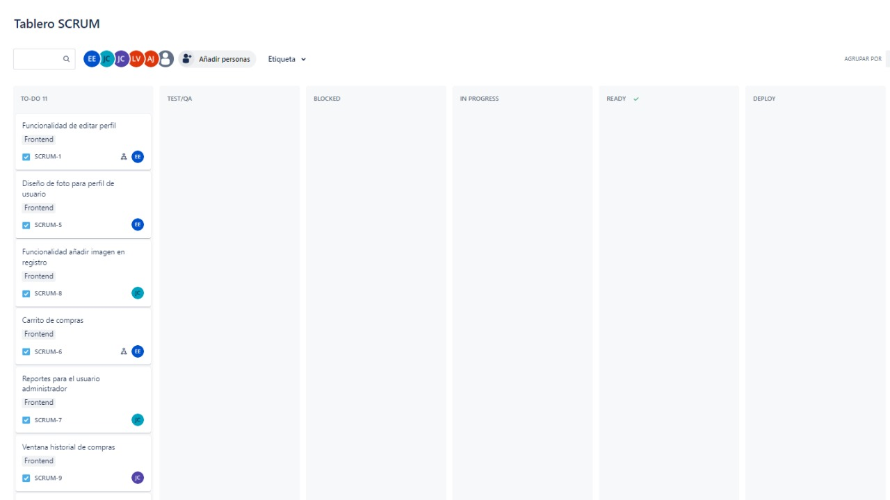
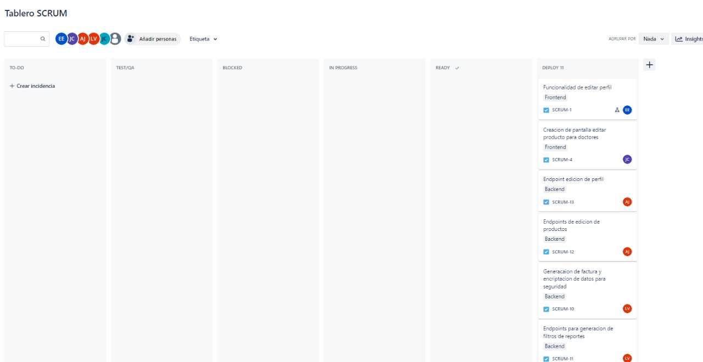

# Proyecto 1 Fase 2 Grupo 4 AyD2

# Documentación Sprint #1

* Esteban Humberto Valdez Ennati        - 202011535
* Luis Angel Barrera Velásquez          - 202010223
* Josué Rodolfo Morales Castillo        - 202010033
* Ayeser Cristian Oxlaj Juarez          - 202010025
* Juan Pablo García Ceballos            - 201901598

- ## Daily´s Scrum Sprint 1
- ### Día 1 (18/03/2024)
    - Esteban Valdez: reacondicionamiento de funcionalidades del frontend (insert image paciente)
    - Angel Barrera: Modificación de los endpoint de registro para recibir imagen en base 64.
    - Rodolfo Morales: reacondicionamiento de funcionalidades del frontend (insert image doctor).
    - Ayeser Oxlaj: Modificación de los endpoint de ver perfil para enviar imagen en formato url.
    - Pablo García: Escribir pruebas unitarias para validar las unidades individuales de código.
- ### Día 2 (19/03/2024)
    - Esteban Valdez: funcionalidad del frontend de Editar el perfil del usuario.
    - Angel Barrera: realización del endpoint para editar perfil de usuario.
    - Rodolfo Morales: realización de Agregar imagen en registro y cambiarla en el perfil
    - Ayeser Oxlaj: realización del endpoint para agregar imagen en registro y cambiarla en el perfil.
    - Pablo García: Añadir pruebas unitarias para validar las unidades individuales de código añadido.
- ### Día 3 (20/03/2024)
    - Esteban Valdez: se añadió el carrito de compras a manera que el usuario vaya agregando los productos que quiera.
    - Angel Barrera: recibir el listado de compras en un endpoint de compras para la lista de productos.
    - Rodolfo Morales: se agregó la funcionalidad que el usuario selecciona la cantidad de productos que necesita y puede seleccionar como máximo lo que existe de stock.
    - Ayeser Oxlaj: devolver en el endpoint la cantidad de productos disponibles en stock 
    - Pablo García: Elaborar un documento Markdown que describe las pruebas de aceptación
- ### Día 4 (21/03/2024)
    - Esteban Valdez: Se añadio darle al usuario la elección del método de pago.
    - Angel Barrera: incluir la recepción del endpoint del método de pago y encriptación al momento de guardar esos datos en la base de datos.
    - Rodolfo Morales: Se añadio darle al usuario la elección de elegir el la forma de envio o si desea recoger en el hospital.
    - Ayeser Oxlaj: incluir en la recepción del endpoint el método de envío.
    - Pablo García: Revisar el documento de las pruebas de aceptación
- ### Día 5 (22/03/2024)
    - Esteban Valdez: envío de la información para registrar la compra.
    - Angel Barrera: recepción en el endpoint compra de la información de la compra y realizar el descuento de los productos en stock.
    - Rodolfo Morales: realización de la generación de factura.
    - Ayeser Oxlaj: proporcionar al frontend los datos necesarios para la realización de la factura.
    - Pablo García: Escribir pruebas de integración para verificar la correcta interacción entre los diferentes componentes del api. 
- ### Día 6 (25/03/2024)
    - Esteban Valdez: mostrar al usuario el historial de compras.
    - Angel Barrera: realizar el endpoint para devolver el historial de compras del usuario.
    - Rodolfo Morales: mostrar el perfil al doctor y que pueda editar su perfil.
    - Ayeser Oxlaj: realizar el endpoint de update doctor para poder recibir sus datos y en caso que modifique la imagen recibir en base 64.
    - Pablo García: Documentar las pruebas de regresión
- ### Día 7 (26/03/2024)
    - Esteban Valdez: corrección de error del frontend al mostrar los productos.
    - Angel Barrera: reestructuración del endpoint que mostraba los productos apoyando a la solucion del error del frontend. 
    - Rodolfo Morales: editar la información de un producto del lado del frontend. 
    - Ayeser Oxlaj: realizar el endpoint que recibe los datos nuevos del producto modificado y modificar ese producto en la base de datos.
    - Pablo García: Asegurar que las nuevas funcionalidades desarrolladas no rompan las características existentes. 
- ### Día 8 (27/03/2024)
    - Esteban Valdez: realización del reporte últimos 5 usuarios registrados.
    - Angel Barrera: proporcionar informacion del reporte ultimos 5 usuarios registrados de la base de datos.
    - Rodolfo Morales: realización del reporte Top 3 productos con mayor stock.
    - Ayeser Oxlaj: proporcionar información del reporte Top 3 productos con mayor stock de la base de datos.
    - Pablo García: Asegurar que las nuevas funcionalidades desarrolladas no rompan las características existentes. 
- ### Día 9 (28/03/2024)
    - Esteban Valdez: realización del reporte Top 3 productos por precio.
    - Angel Barrera:proporcionar información del reporte Top 3 productos por precio de la base de datos.
    - Rodolfo Morales: realización del reporte Doctores con mayor cantidad de citas atendidas.
    - Ayeser Oxlaj: proporcionar información del reporte Doctores con mayor cantidad de citas atendidas de la base de datos.
    - Pablo García:Validar nuevas funcionalidades del api.
- ### Día 10 (29/03/2024)
    - Esteban Valdez: realización del reporte Top 3 productos con menor stock.
    - Angel Barrera: proporcionar información del reporte Top 3 productos con menor stock de la base de datos.
    - Rodolfo Morales: subida del frontend a la nube.
    - Ayeser Oxlaj: subida del backend a la nube.
    - Pablo García: Revisión de todas las pruebas realizadas hasta el momento.

- ## Tabla Sprint Backlog
| Tarea                                                                       | Estado         | Justificación (si no se completó)                                                                                                    |
| --------------------------------------------------------------------------- | -------------- | --------------------------------------------------------------------------------------------------------------------------------------- |
| Reacondicionamiento de funcionalidades del frontend (insert image paciente) | Completado     | -                                                                                                                                     |
| Modificación de los endpoint de registro para recibir imagen en base 64     | Completado     | -                                                                                                                                     |
| Reacondicionamiento de funcionalidades del frontend (insert image doctor)   | Completado     | -                                                                                                                                     |
| Modificación de los endpoint de ver perfil para enviar imagen en formato url| Completado     | -                                                                                                                                     |
| Escribir pruebas unitarias para validar las unidades individuales de código| Completado     | -                                                                                                                                     |
| Funcionalidad del frontend de Editar el perfil del usuario                  | Completado     | -                                                                                                                                     |
| Realización del endpoint para editar perfil de usuario                      | Completado     | -                                                                                                                                     |
| Realización de Agregar imagen en registro y cambiarla en el perfil         | Completado     | -                                                                                                                                     |
| Realización del endpoint para agregar imagen en registro y cambiarla en el perfil| Completado | -                                                                                                                                     |
| Añadir pruebas unitarias para validar las unidades individuales de código añadido| Completado | -                                                                                                                                     |
| Se añadió el carrito de compras a manera que el usuario vaya agregando los productos que quiera | Completado | -                                                                                      |
| Recibir el listado de compras en un endpoint de compras para la lista de productos | Completado | -                                                                                           |
| Se agregó la funcionalidad que el usuario selecciona la cantidad de productos que necesita y puede seleccionar como máximo lo que existe de stock | Completado | - |
| Devolver en el endpoint la cantidad de productos disponibles en stock      | Completado     | -                                                                                                                                     |
| Elaborar un documento Markdown que describe las pruebas de aceptación     | Completado     | -                                                                                                                                     |
| Se añadió darle al usuario la elección del método de pago                  | Completado     | -                                                                                                                                     |
| Incluir la recepción del endpoint del método de pago y encriptación al momento de guardar esos datos en la base de datos | Completado | -                                                                    |
| Se añadió darle al usuario la elección de elegir el la forma de envio o si desea recoger en el hospital | Completado | -                                                                              |
| Incluir en la recepción del endpoint el método de envío                     | Completado     | -                                                                                                                                     |
| Revisar el documento de las pruebas de aceptación                           | Completado     | -                                                                                                                                     |
| Envío de la información para registrar la compra                            | Completado     | -                                                                                                                                     |
| Recepción en el endpoint compra de la información de la compra y realizar el descuento de los productos en stock | Completado | -                                                                      |
| Realización de la generación de factura                                    | Completado     | -                                                                                                                                     |
| Proporcionar al frontend los datos necesarios para la realización de la factura | Completado | -                                                                                     |
| Escribir pruebas de integración para verificar la correcta interacción entre los diferentes componentes del API | Completado | -     |
| Mostrar al usuario el historial de compras                                 | Completado     | -                                                                                                                                     |
| Realizar el endpoint para devolver el historial de compras del usuario     | Completado     | -                                                                                                                                     |
| Mostrar el perfil al doctor y que pueda editar su perfil                   | Completado     | -                                                                                                                                     |
| Realizar el endpoint de update doctor para poder recibir sus datos y en caso que modifique la imagen recibir en base 64 | Completado | -  |
| Documentar las pruebas de regresión                                        | Completado     | -                                                                                                                                     |
| Corrección de error del frontend al mostrar los productos                  | Completado     | -                                                                                                                                     |
| Reestructuración del endpoint que mostraba los productos apoyando a la solución del error del frontend | Completado | -                                                                        |
| Editar la información de un producto del lado del frontend                 | Completado     | -                                                                                                                                     |
| Realizar el endpoint que recibe los datos nuevos del producto modificado y modificar ese producto en la base de datos | Completado | -   |
| Asegurar que las nuevas funcionalidades desarrolladas no rompan las características existentes | Completado | -                                                                              |
| Realización del reporte últimos 5 usuarios registrados                     | Completado     | -                                                                                                                                     |
| Proporcionar informacion del reporte ultimos 5 usuarios registrados de la base de datos | Completado | -                                                                                       |
| Realización del reporte Top 3 productos con mayor stock                    | Completado     | -                                                                                                                                     |
| Proporcionar información del reporte Top 3 productos con mayor stock de la base de datos | Completado | -                                                                                            |
| Realización del reporte Top 3 productos por precio                         | Completado     | -                                                                                                                                     |
| Proporcionar información del reporte Top 3 productos por precio de la base de datos | Completado | -                                                                                                |
| Realización del reporte Doctores con mayor cantidad de citas atendidas      | Completado     | -                                                                                                                                     |
| Proporcionar información del reporte Doctores con mayor cantidad de citas atendidas de la base de datos | Completado | -                                                                                     |
| Realización del reporte Top 3 productos con menor stock                    | Completado     | -                                                                                                                                     |
| Proporcionar información del reporte Top 3 productos con menor stock de la base de datos | Completado | -                                                                                                 |
| Subida del frontend a la nube                                              | Completado     | -                                                                                                                                     |
| Subida del backend a la nube                                               | Completado     | -                                                                                                                                     |
| Revisión de todas las pruebas realizadas hasta el momento                  | Completado     | -                                                                                                                                     |

- ## Tablero previo al inicio del sprint: 

- ## Tablero al final del sprint

- ## Sprint planning
## Listado de funcionalidades del usuario:

- **Editar el perfil del usuario**
- **Agregar imagen en registro y cambiarla en el perfil**
- **Carrito de compras**
- **Elegir la cantidad de productos a comprar**
- **Elegir método de pago (efectivo o tarjeta)**
- **Elegir forma de envío o si se quiere ir a recoger al hospital**
- **Generar compra y dar factura**
- **Ver historial de compras**

## Listado de funcionalidades del usuario doctor:

- **Ver perfil y editar doctor**
- **Editar un producto**

## Listado de reportes:

- **Reporte de productos más comprados**
- **Doctor con más pacientes atendidos**
- **Productos con mayor cantidad en stock**
- **Reporte de últimos 5 usuarios registrados**
- **Top precios de productos**

## Estructura general de la base de datos y modificaciones:

(Descripción de la estructura general de la base de datos y cualquier modificación realizada)

- ## Sprint Retrospective
| Nombre | Esteban Valdez |
|----------|----------|
| *¿Qué se hizo bien durante el Sprint?* | Fue genial organizar las tareas con kanban, pero creo que deberíamos mejorar en cumplir los plazos. |
| *¿Qué se hizo mal durante el Sprint?* | A veces nos retrasamos un poco con la implementación, algo en lo que todos podríamos trabajar. |
| *¿Qué mejoras se deben implementar para el próximo sprint?* | Quizás deberíamos ser más estrictos con el tiempo de implementación para mantenernos en el camino. |

| Nombre | Angel Barrera |
|----------|----------|
| *¿Qué se hizo bien durante el Sprint?* | Logramos resolver problemas de encriptación y estoy emocionado por investigar más sobre patrones de diseño. |
| *¿Qué se hizo mal durante el Sprint?* | AWS RDS nos causó algunos dolores de cabeza, así que podríamos profundizar en eso. |
| *¿Qué mejoras se deben implementar para el próximo sprint?* | Tal vez enfocarnos más en entender y solucionar problemas con AWS. |

| Nombre | Rodolfo Morales |
|----------|----------|
| *¿Qué se hizo bien durante el Sprint?* | Me encantó liderar la asignación de tareas, pero admito que nos retrasamos un poco. |
| *¿Qué se hizo mal durante el Sprint?* | Necesitamos mejorar en la ejecución de tareas, para no perder tiempo. |
| *¿Qué mejoras se deben implementar para el próximo sprint?* | Vamos a trabajar en ser más eficientes con nuestro tiempo.|

| Nombre | Ayeser Oxlaj |
|----------|----------|
| *¿Qué se hizo bien durante el Sprint?* | Logramos implementar el EndPoint "uploadCSV", lo cual fue genial. |
| *¿Qué se hizo mal durante el Sprint?* | AWS Cognito y S3 nos dieron algunos problemas, deberíamos profundizar en esos temas. |
| *¿Qué mejoras se deben implementar para el próximo sprint?* | Reforzar nuestra comprensión de la configuración de servicios de AWS. |

| Nombre | Pablo García |
|----------|----------|
| *¿Qué se hizo bien durante el Sprint?* | Contribuí evaluando librerías y estilos, pero tuve algunos problemas con la librería CSV. |
| *¿Qué se hizo mal durante el Sprint?* | La librería CSV fue un dolor de cabeza, creo que necesito entenderla mejor. |
| *¿Qué mejoras se deben implementar para el próximo sprint?* | Necesito profundizar en la comprensión de las librerías que utilizamos y gestionar mejor los problemas que puedan surgir. |

