# Manual de Usuario - GT Hospital

Bienvenido/a al sistema de gestión de salud en línea. A continuación, se detallan las funciones disponibles para los distintos roles de usuario en la página web.

## Contenido
1. [**Login**](#login)
2. [**Registro**](#registro)
3. [**Módulo Pacientes**](#módulo-pacientes)
    - [Perfil](#perfil)
    - [Agendar Cita](#agendar-cita)
    - [Ver Productos en la Tienda](#ver-productos-en-la-tienda)
    - [Appointment History](#appointment-history)
    
4. [**Módulo Administrador**](#módulo-administrador)
    - [Carga Masiva Usuarios](#cargamasiva)
    - [Carga Eliminar Doctor](#eliminardoctor)
    - [Carga Eliminar Usuarios](#eliminarusuario)
    - [Carga Masiva Productos](#cargamasiva2)

5. [**Módulo Doctor**](#módulo-doctor)
    - [Atender](#atender)
    - [Historial](#historial)
---

## 1. Login 

El sistema de login es la puerta de entrada a la plataforma. Todos los roles de usuario (doctores, pacientes, etc.) pueden utilizar esta funcionalidad para acceder a sus cuentas. 

### Instrucciones de Uso:
1. Visite la página de inicio.
2. Haga clic en el enlace de "Login".
3. Ingrese su correo electrónico y contraseña.
4. Haga clic en "Iniciar Sesión".

#### En caso de olvidar contraseña: 
1. Presione el boton de "Forgot password?".
2. Ingrese correo electrónico y presione el boton de "Reset Password".

3. En la ventana emergente introducir el codigo enviado a su correo asi como la nueva contraseña.
4. Haga clic en "Send".
5. Su contraseña se habra cambiado.

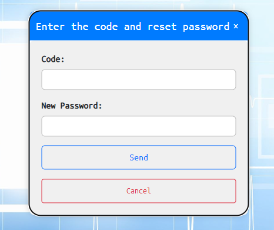

---

## 2. Registro 

El registro está disponible solo para pacientes. Este proceso le permitirá crear una cuenta en la plataforma y acceder a todas las funciones destinadas a los pacientes.

### Instrucciones de Uso:
1. Desde la página de inicio, haga clic en el enlace de "Registro" destinado a pacientes.
2. Complete el formulario de registro con la información requerida.
3. Haga clic en "Registrarse" para crear su cuenta.

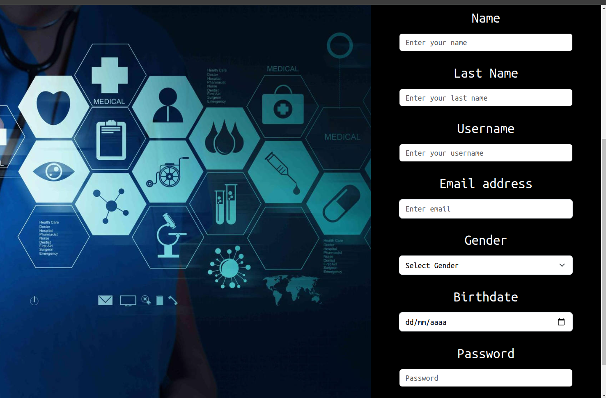

---

## 3. Módulo Pacientes 

Este módulo está diseñado específicamente para los pacientes y ofrece diversas funcionalidades para gestionar su salud de manera efectiva.

### 3.1 Perfil 

La sección de perfil le permite visualizar y editar su información personal.

#### Instrucciones de Uso:
1. Desde el panel de control, seleccione la opción "Perfil".
2. Visualice y edite sus datos según sea necesario.
3. Guarde los cambios realizados.

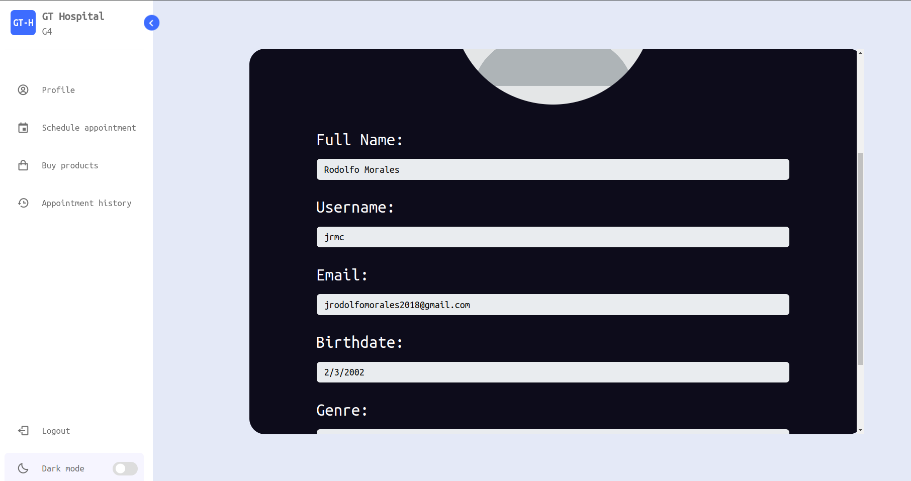

### 3.2 Agendar Cita 

Con esta funcionalidad, puede programar citas con los doctores de manera conveniente.

#### Instrucciones de Uso:
1. Acceda al módulo de pacientes.
2. Seleccione la opción "Agendar Cita".
3. Introduzca la descripción y la fecha de la cita.
4. Confirme la cita.

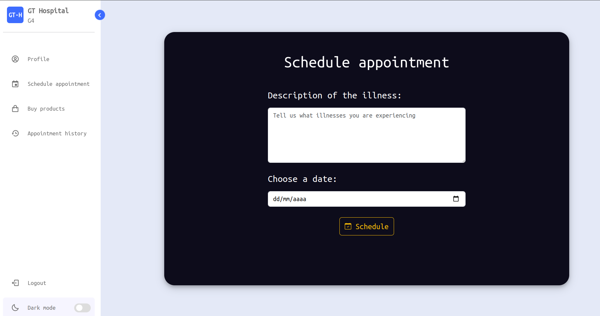

### 3.3 Ver Productos en la Tienda 

Explore los productos disponibles en nuestra tienda en línea.

#### Instrucciones de Uso:
1. Diríjase al módulo de pacientes.
2. Seleccione la opción "Ver Tienda".
3. Navegue por los productos disponibles.

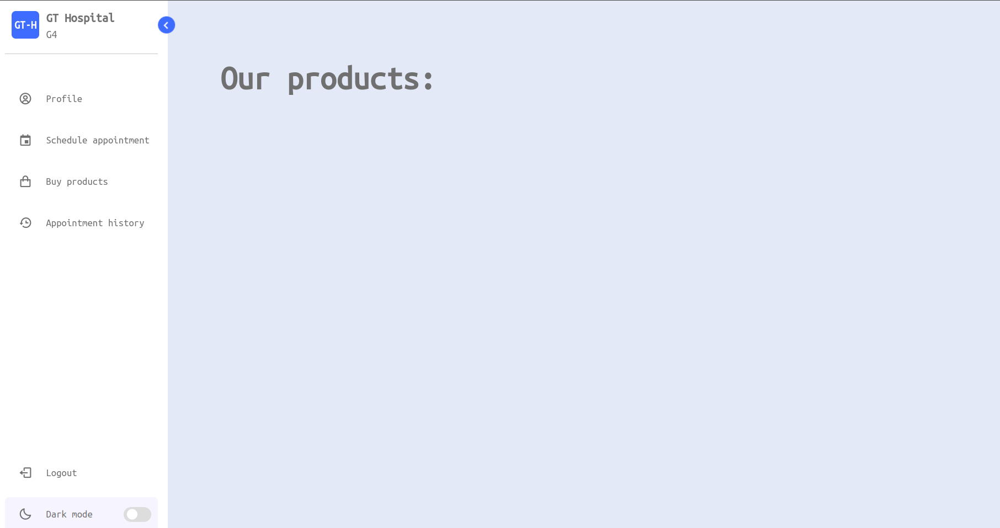

### 3.4 Appointment History 

La sección de historial de citas muestra todas las citas pasadas.

#### Instrucciones de Uso:
1. Vaya al módulo de pacientes.
2. Seleccione la opción "Appointment History".
3. Visualice la información detallada de sus citas anteriores.

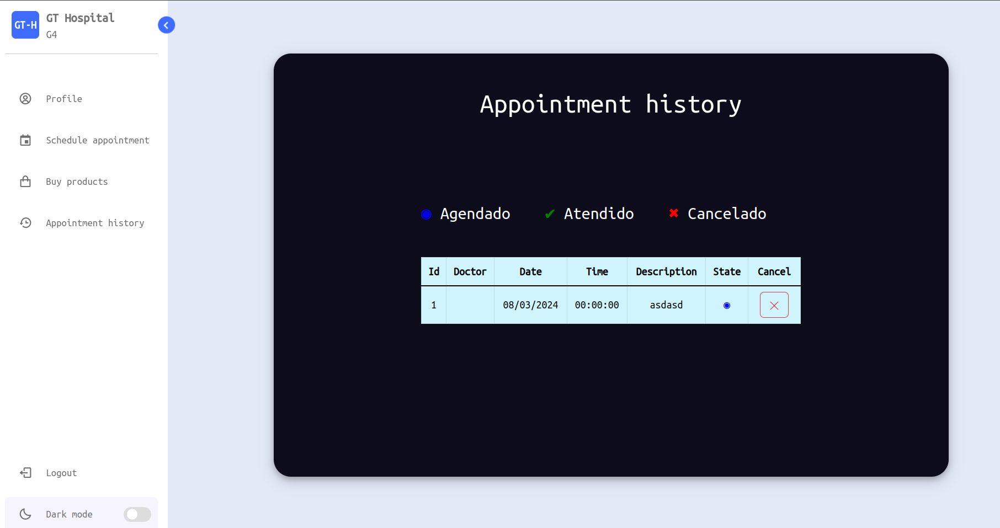
---

## 4. Módulo Administrador 
Esta seccion esta dirigida al administrador del sistema el cual podra: Cargar masiva de doctores, eliminar Usuarios y doctores, Ingresar manualmente o masivamente los productos. 

### 4.1 Carga Masiva Doctores 
En esta seccion se tiene la opcion de cargar un archivo csv con los datos de todos los usuarios que se deseen carga al sistema. 

#### Instrucciones de Uso:
1. Diríjase al módulo de carga masiva
2. Seleccione la opción "seleccionar".
3. Cargue el archivo.

### 4.2 Eliminar Doctor 
En esta seccion se puede ver el listado de todos los doctores registrador en el sistema, mostrando el nombre, id y username del doctor que se quiera eliminar, con el boton eliminar el cual lo eliminara totalmente del sistema. 

#### Instrucciones de Uso:
1. Diríjase al módulo de eliminar doctor
2. Seleccione la opción el doctor.
3. Elimine el doctor.

### 4.3 Eliminar Usuario 
En esta seccion se puede ver el listado de todos los usuarios registrador en el sistema, mostrando el nombre, id y username del usuario que se quiera eliminar, con el boton eliminar el cual lo eliminara totalmente del sistema. 
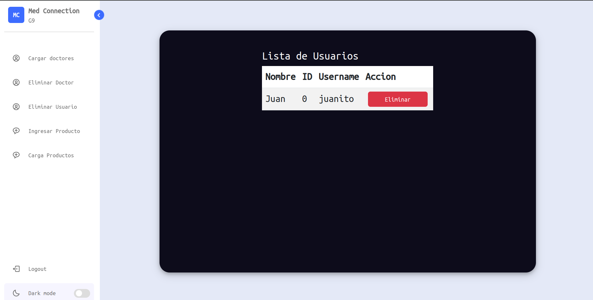

#### Instrucciones de Uso:
1. Diríjase al módulo de eliminar usuario
2. Seleccione la opción el usuario.
3. Elimine el usuario.

### 4.4 Ingresar Producto 
En esta seccion se puede un nuevo producto, ingresando los campos: Nombre, Descripcion, Precio, Stock e Imagen, el cual se registraran en el sistema. 

#### Instrucciones de Uso:
1. Diríjase al módulo de Ingresar Producto
2. Ingrese todos los campos.
3. Ingrese el producto.

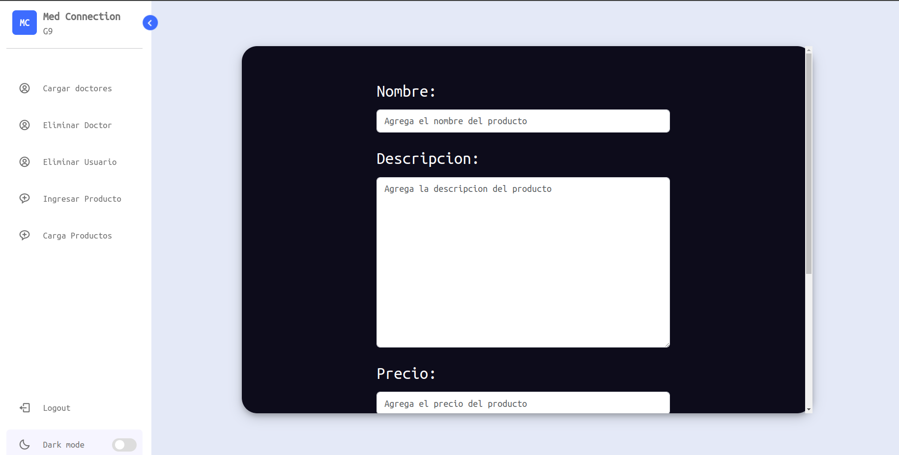

### 4.5 Carga Masiva Productos 
En esta seccion se tiene la opcion de cargar un archivo csv con los datos de todos los productos que se deseen carga al sistema. 
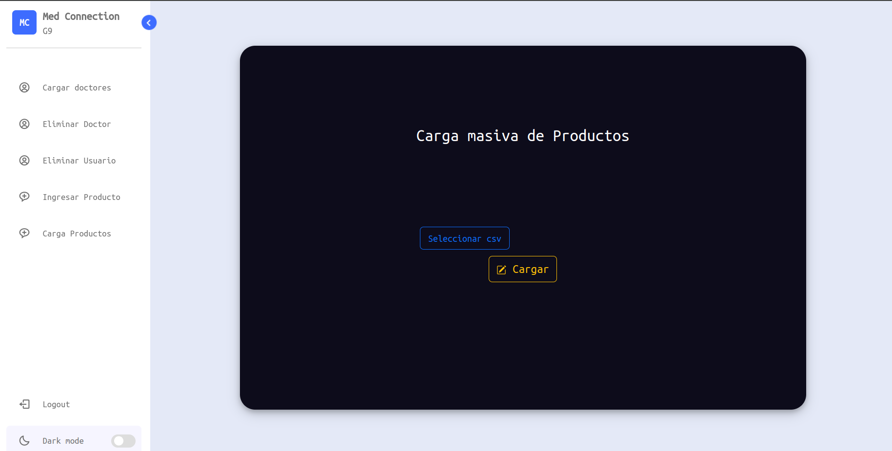

#### Instrucciones de Uso:
1. Diríjase al módulo de cargar productos
2. Seleccione la opción "seleccionar" y selecciona el csv.
3. Cargue el archivo.

## 5. Módulo Doctor 
Esta seccion esta dirigida al doctor el cual podra: Atender citas y ver el historial. 

### 5.1 Atender Citas 
En esta seccion se tiene de atender un paciente

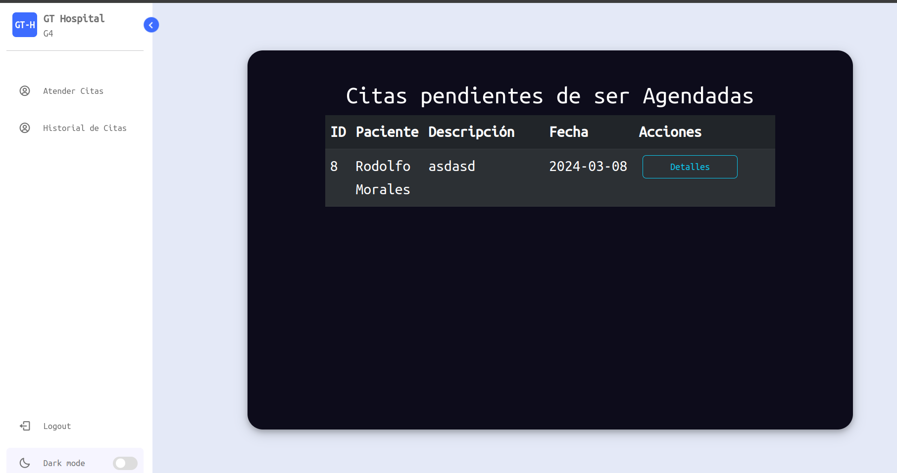

### 5.3 Historial citas
En esta seccion se puede ver historial de cita. 
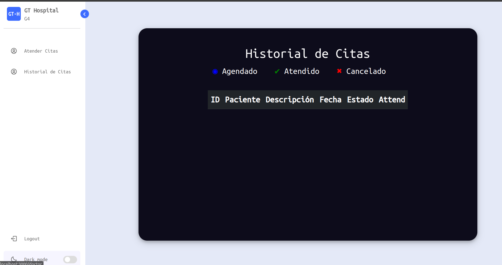

¡Gracias por utilizar nuestro sistema de gestión de salud en línea! Si tiene alguna pregunta o necesita asistencia, no dude en ponerse en contacto con nuestro servicio de soporte. ¡Le deseamos una experiencia saludable y positiva!