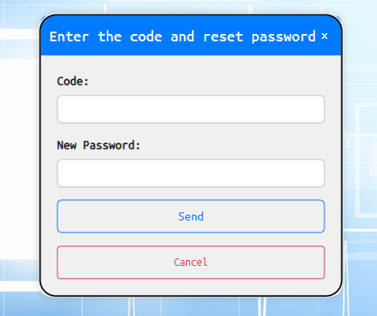

# Manual de Usuario - GT Hospital Mobile

Bienvenido/a al sistema de gestión de salud en app mobile. A continuación, se detallan las funciones disponibles para los distintos roles de usuario en la aplicación.

## Contenido
1. [**Login**](#login)
2. [**Registro**](#registro)
3. [**Módulo Pacientes**](#módulo-pacientes)
    - [Perfil](#perfil)
    - [Agendar Cita](#agendar-cita)
    - [Ver Productos en la Tienda](#ver-productos-en-la-tienda)
    - [Appointment History](#appointment-history)
    
4. [**Módulo Administrador**](#módulo-administrador)
    - [Carga Masiva Usuarios](#cargamasiva)
    - [Carga Eliminar Doctor](#eliminardoctor)
    - [Carga Eliminar Usuarios](#eliminarusuario)
    - [Carga Masiva Productos](#cargamasiva2)

5. [**Módulo Doctor**](#módulo-doctor)
    - [Atender](#atender)
    - [Historial](#historial)
---

## 1. Login 

El sistema de login es la puerta de entrada a la plataforma. Todos los roles de usuario (doctores, pacientes, etc.) pueden utilizar esta funcionalidad para acceder a sus cuentas. 

### Instrucciones de Uso:
1. Visite la página de inicio.
2. Haga clic en el enlace de "Login".
3. Ingrese su correo electrónico y contraseña.
4. Haga clic en "Iniciar Sesión".

#### En caso de olvidar contraseña: 
1. Presione el boton de "Forgot password?".
2. Ingrese correo electrónico y presione el boton de "Reset Password".

3. En la ventana emergente introducir el codigo enviado a su correo asi como la nueva contraseña.
4. Haga clic en "Send".
5. Su contraseña se habra cambiado.

---

## 2. Registro 

El registro está disponible solo para pacientes. Este proceso le permitirá crear una cuenta en la plataforma y acceder a todas las funciones destinadas a los pacientes.

### Instrucciones de Uso:
1. Desde la página de inicio, haga clic en el enlace de "Registro" destinado a pacientes.
2. Complete el formulario de registro con la información requerida.
3. Haga clic en "Registrarse" para crear su cuenta.

---

## 3. Módulo Pacientes 

Este módulo está diseñado específicamente para los pacientes y ofrece diversas funcionalidades.

### 3.1 Login como paciente 

En la pantalla de login, ingresamos las credenciales de un paciente y si los datos son correctos se nos mostrará el mensaje de bienvenida.

### 3.2 Home Paciente 

En esta pantalla se muestra un menú de navegación para el rol de paciente el cual cada botón redirige a una pantalla distinta.

### 3.3 Perfil paciente 

En esta pantalla se muestra la información del paciente que está loggeado, en esta misma se pueden editar ciertos campos y la imagen de perfil.

### 3.4 Programar cita 

En esta pantalla se pueden programar una cita, en esta misma se debe detallar el motivo y escoger una fecha para agendar, luego se mostrará un mensaje de confirmación.

### 3.5 Ver productos 

En esta pantalla se muestran la lista de productos, detallando distintas características.

### 3.6 Historial citas paciente 

En esta pantalla se muestra el historial de citas para los pacientes, en el cual existen distintos estados, también se puede cancerlar citas en caso estas estén en espera o en estado agendado.

## 5. Módulo Doctor 
Este módulo está diseñado específicamente para los doctores y ofrece diversas funcionalidades.

### 5.1 Login como doctor 

En la pantalla de login, ingresamos las credenciales de un doctor y si los datos son correctos se nos mostrará el mensaje de bienvenida.

### 5.2 Home Doctor 

En esta pantalla se muestra un menú de navegación para el rol de doctor el cual cada botón redirige a una pantalla distinta.

### 5.3 Perfil doctor 

En esta pantalla se muestra la información del doctor que está loggeado, en esta misma se pueden editar ciertos campos y la imagen de perfil.

### 5.4 Atender citas 

En esta pantalla se muestra la lista de citas que necesitan ser atendidas, para atender una cita el doctor debe seleccionar una cita y le mostrará una nueva pantalla donde se asignará una hora y se mostrará un mensaje de confirmación.

### 5.5 Historial de citas 

En esta pantalla se muestra la lista de citas con distintos estados, se muestran las citas canceladas atendidas y las agendadas las cuales se les puede cambiar el estado a atendidas.

### 5.6 Logout 

Esta opción nos regresa al Login y borra la información del usuario actual.

¡Gracias por utilizar nuestro sistema de gestión de salud mobile! Si tiene alguna pregunta o necesita asistencia, no dude en ponerse en contacto con nuestro servicio de soporte. ¡Le deseamos una experiencia saludable y positiva!