# Proyecto 1 Fase 2 Grupo 4 AyD2

# Manual Tecnico

* Esteban Humberto Valdez Ennati        - 202011535
* Luis Angel Barrera Velásquez          - 202010223
* Josué Rodolfo Morales Castillo        - 202010033
* Ayeser Cristian Oxlaj Juarez          - 202010025
* Juan Pablo García Ceballos            - 201901598

## Diagrama del Diseño Arquitectónico
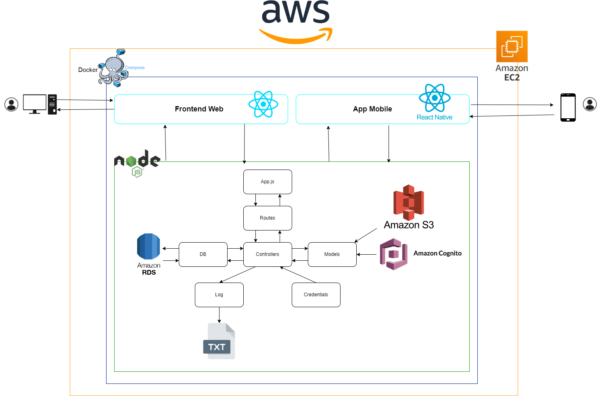

## Diagrama Entidad Relación
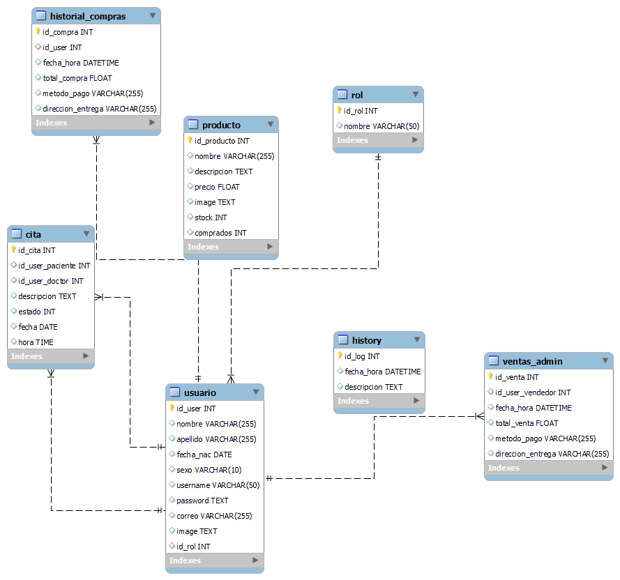

## Diagrama General de la Estructura de la Aplicación


# Listado de endpoints/metodos y descripción

## Endpoint: /comprar

### Método: POST

Este endpoint se utiliza para realizar una compra.

#### Parámetros de entrada:

- **productos** (array): Un array de objetos que representa los productos a comprar.
  - **id_producto** (integer): El ID del producto a comprar.
  - **cantidad** (integer): La cantidad de unidades a comprar del producto.
- **pago** (string): El método de pago. En caso de ser con tarjeta, se envía el número de tarjeta como string. En caso de ser en efectivo, se envía el texto "efectivo".
- **direccion** (string): La dirección de entrega. En caso de querer recoger en el hospital, se envía el texto "hospital".
- **id_user** (integer): El ID del usuario que realiza la compra.
- **total_compra** (float): El total de la compra.

#### Ejemplo de solicitud:

```json
{
	"productos":[
		{
		"id_producto": 1,
		"cantidad": 2
		},
		{
		"id_producto": 1,
		"cantidad": 2
		},
		{
		"id_producto": 1,
		"cantidad": 2
		}
	],
	"pago": "26465265465406 o efectivo",
	"direccion": "direccion x ó hospital",
	"id_user": 1,
	"total_compra": 256.25
}
```
#### Respuesta correcta:
```json
Copy code
{
	"status": true,
	"id_compra": "ayesexo69"
}
```


# Endpoint: /updateUser

## Tipo: PUT

Este endpoint se utiliza para actualizar el perfil de los usuarios.

### Parámetros de entrada:

- **id_user** (integer): El ID del usuario.
- **nombre** (string): El nombre del usuario.
- **apellido** (string): El apellido del usuario.
- **username** (string): El nombre de usuario.
- **correo** (string): El correo electrónico del usuario.
- **fecha_nac** (string): La fecha de nacimiento del usuario (formato: YYYY-MM-DD).
- **sexo** (string): El sexo del usuario (M o F).
- **newPassword** (string): La nueva contraseña.
- **currentPassword** (string): La contraseña actual para validar.
- **image** (string): La imagen del usuario en formato base64.
- **imageBool** (boolean): Indica si se actualizó la imagen (True) o no (False).

### Ejemplo de solicitud:

```json
{
  "id_user": 5,
  "nombre": "Rodolfo",
  "apellido": "Morales",
  "username": "luisbarrera23",
  "correo": "luisbarrera5662@gmail.com",
  "fecha_nac": "2000-11-23",
  "sexo": "M o F",
  "newPassword": "87654321",
  "currentPassword": "12345678",
  "image": "base64 de la imagen",
  "imageBool": true
}
```
### Respuesta exitosa:
``` json
{
    "message": "Your profile was successfully updated.",
    "success": true,
	"user": {
        "id_user": 5,
        "nombre": "Luis",
        "apellido": "Barrera",
        "fecha_nac": "2000-11-23T06:00:00.000Z",
        "sexo": "M",
        "username": "Esteban xd",
        "password": "b23f1baf404e6908edef40f15dc7d135",
        "correo": "losafo5890@artgulin.com",
        "image": "link de la imagen",
        "rol": 1
    }
}
```
### Respuesta fallida:
```json
{
    "message": "There was a problem updating your profile, try again.",
    "success": false
}
```

# Endpoint: /updateProduct/:id_product

## Método: PUT

Este endpoint se utiliza para actualizar un producto.

### Parámetros de entrada:

- **id_product** (integer): El ID del producto.
- **name** (string): El nombre del producto.
- **description** (string): La descripción del producto.
- **image** (string): El enlace de la imagen del producto.
- **price** (float): El precio del producto.
- **stock** (integer): El stock disponible del producto.
- **correo** (string): El correo electrónico del usuario que actualiza el producto.

### Ejemplo de solicitud:

```json
{
    "id_product": 1,
    "name": "Aspirina",
    "description": "Para el dolor",
    "image": "Link de la imagen del s3",
    "price": 34.5,
    "stock": 69,
    "correo": "Del usuario que actualiza el producto"
}
```
### Respuesta fallida:
```json
{
    "message": "There was a problem updating the product, try again.",
    "success": false
}
```
### Respuesta exitosa:
```json
{
    "message": "Product updated successfully.",
    "success": true
}
```


## Endpoint: /getReportes/:id_user

### Método: GET

Este endpoint se utiliza para obtener reportes relacionados con un usuario específico.

#### Parámetros de entrada:

- **id_user** (integer): El ID del usuario.

#### Respuesta:

```json
{
    "reporte1": [
        {
            "name": "Rodolfo Morales",
            "email": "Correo del usuario",
            "username": "Nombre de usuario"
        },
        {
            "name": "Rodolfo Morales 2",
            "email": "Correo del usuario",
            "username": "Nombre de usuario"
        }
    ],
    "reporte2": [
        {
            "name": "Rodolfo Morales",
            "email": "Correo del doctor",
            "username": "Nombre del doctor",
            "citas": 12
        },
        {
            "name": "Rodolfo Morales 2",
            "email": "Correo del doctor",
            "username": "Nombre del doctor",
            "citas": 10
        }
    ],
    "reporte3": [
        {
            "name": "nombre del producto",
            "stock": 25
        },
        {
            "name": "nombre del producto",
            "stock": 18
        },
        {
            "name": "nombre del producto",
            "stock": 14
        }
    ],
    "reporte4": [
        {
            "name": "nombre del producto",
            "stock": 1
        },
        {
            "name": "nombre del producto",
            "stock": 2
        },
        {
            "name": "nombre del producto",
            "stock": 3
        }
    ],
    "reporte5": [
        {
            "name": "nombre del producto",
            "price": 50.75
        },
        {
            "name": "nombre del producto",
            "price": 40.00
        },
        {
            "name": "nombre del producto",
            "price": 33.13
        }
    ]
}
```
explicacion mas simplificada de todos los endpoints del proyecto:

| Endpoint                              | Descripción                                                                                             |
|---------------------------------------|---------------------------------------------------------------------------------------------------------|
| /adduser                              | Permite registrar nuevos usuarios, ya sea individualmente o mediante carga masiva.                     |
| /login                                | Permite a los usuarios iniciar sesión proporcionando su correo electrónico y contraseña.              |
| /forgotPassword                       | Envía un código de verificación al correo electrónico del usuario para restablecer la contraseña.      |
| /confirmPasswordReset                 | Permite confirmar el restablecimiento de la contraseña utilizando el código de verificación.          |
| /addCita                              | Permite agregar una cita médica para un usuario específico.                                             |
| /cancelCita                           | Permite cancelar una cita médica previamente agendada.                                                  |
| /getCitas/id_user                     | Obtiene la lista de citas médicas asociadas a un usuario específico.                                     |
| /getCitasEsperando/id_user            | Obtiene la lista de citas médicas en espera para un usuario específico.                                  |
| /agendarCita                          | Permite a un usuario agendar una cita médica previamente en espera.                                      |
| /getCitasDoctor/:id_user_doctor       | Obtiene la lista de citas médicas agendadas para un doctor específico.                                   |
| /atenderCita                          | Permite a un doctor marcar una cita médica como atendida.                                                |
| /products/:id_user                    | Obtiene la lista de productos asociados a un usuario específico.                                         |
| /comprar                              | Permite a un usuario realizar una compra de productos, ya sea mediante tarjeta de crédito o en efectivo.|
| /updateUser                           | Permite actualizar el perfil de un usuario, incluyendo su información personal y contraseña.           |
| /updateProduct/:id_product           | Permite actualizar la información de un producto específico.                                             |
| /getReportes/:id_user                 | Obtiene varios informes relacionados con usuarios, doctores y productos para un usuario específico.    |


## Mockups 
### Login: 

### Registro


## Modulo admin
### Perfil


### Carga Masiva Doctores: 
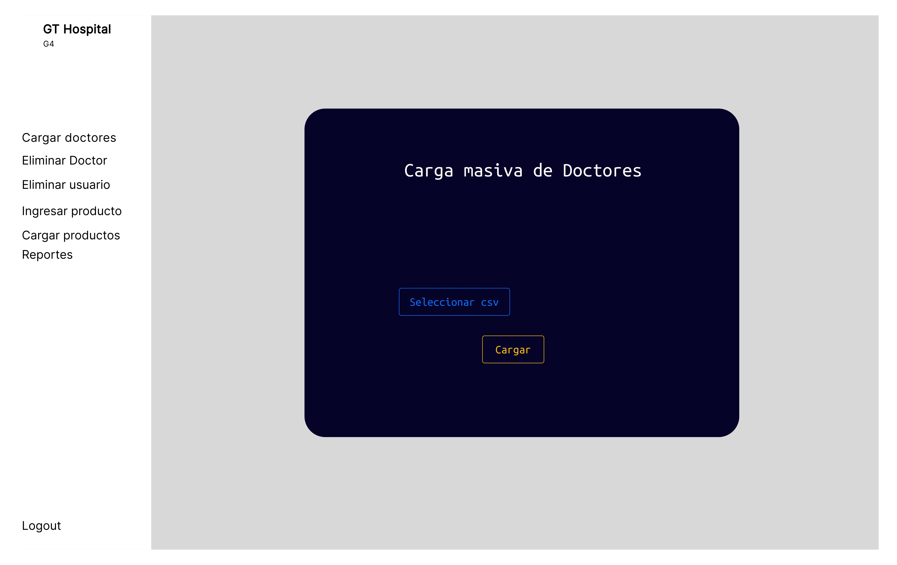
### Carga Masiva Productos

### Lista de Doctores

### Lista de Usuarios
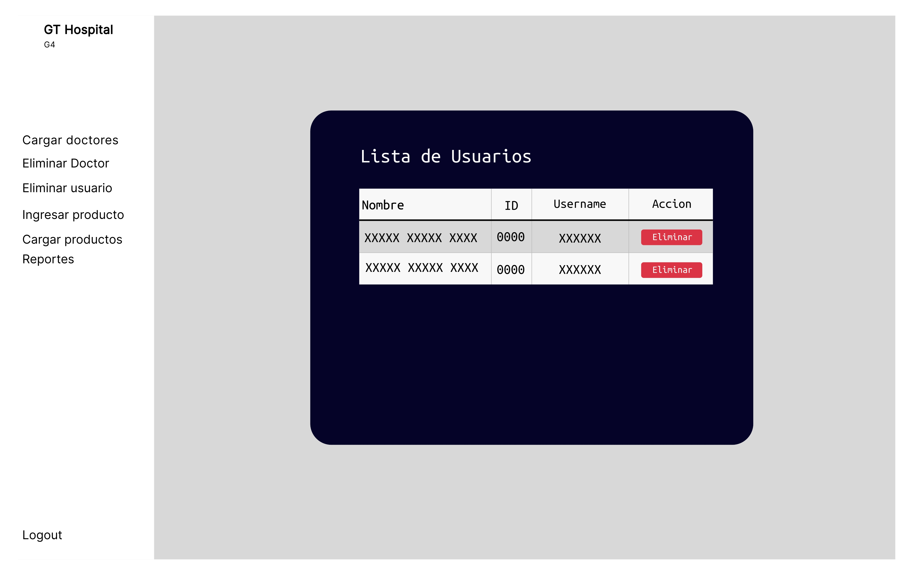
### Ingresar Producto
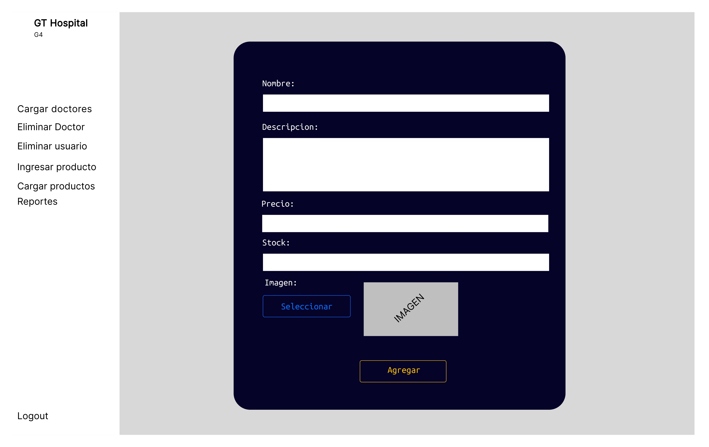

## Modulo Doctor
### Perfil: 
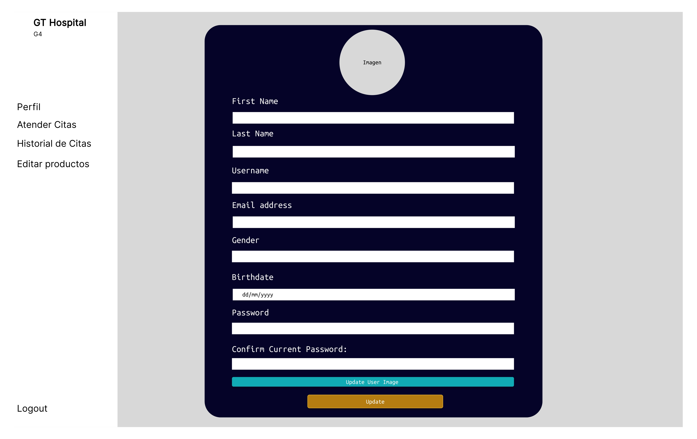
### Atender Citas
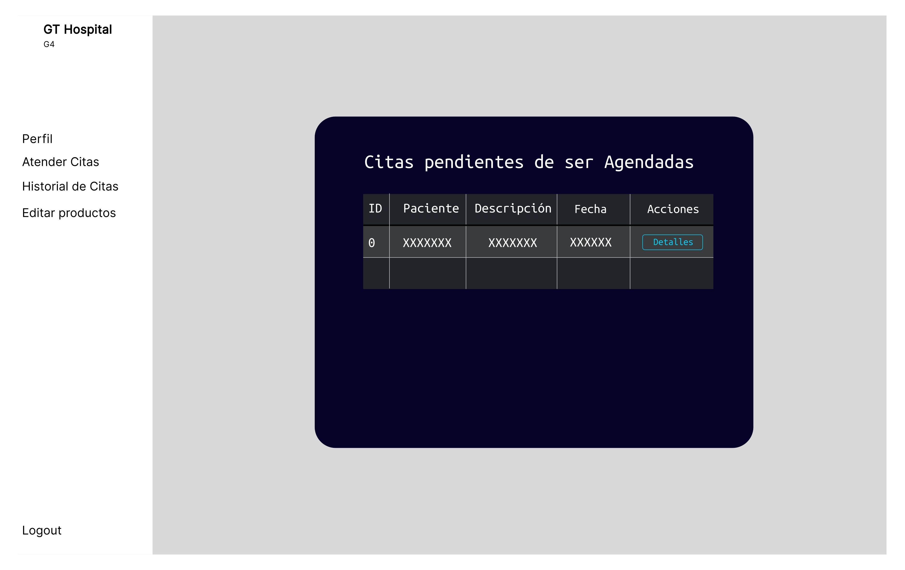
### Historial Citas
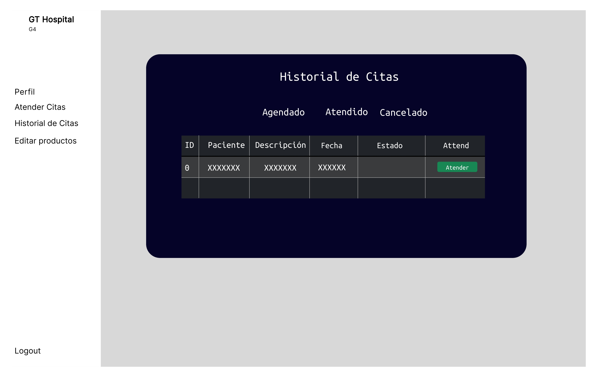
### Editar Producto
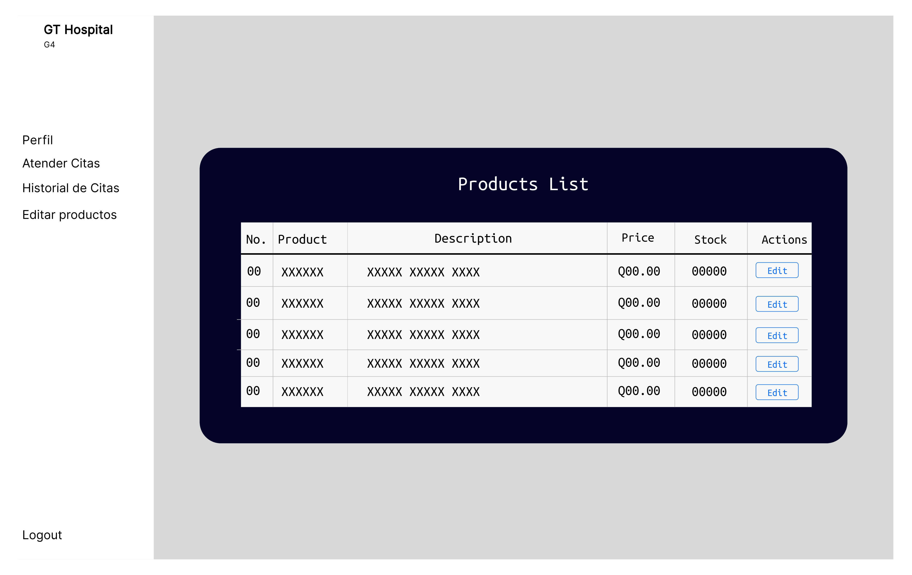

## Modulo Paciente
### Agendar cita: 
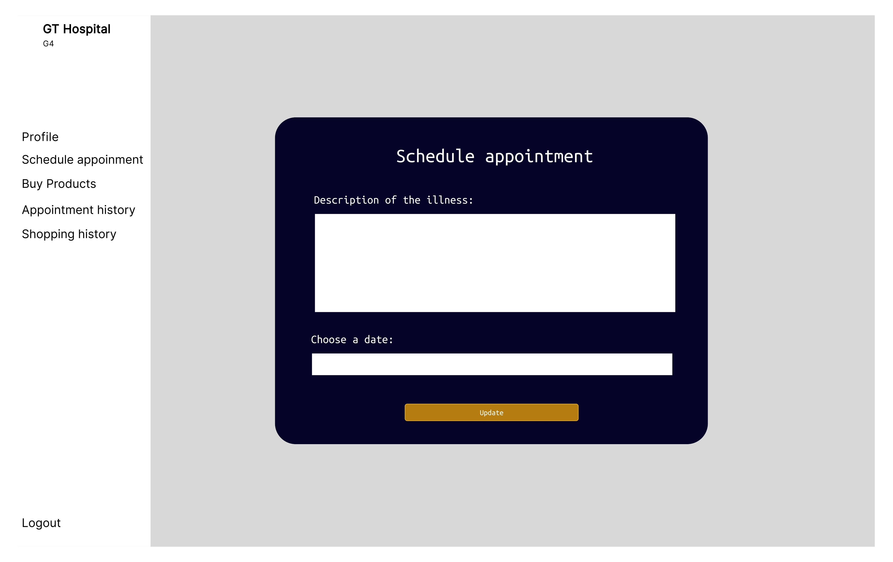
### Historial de Citas

### Tienda
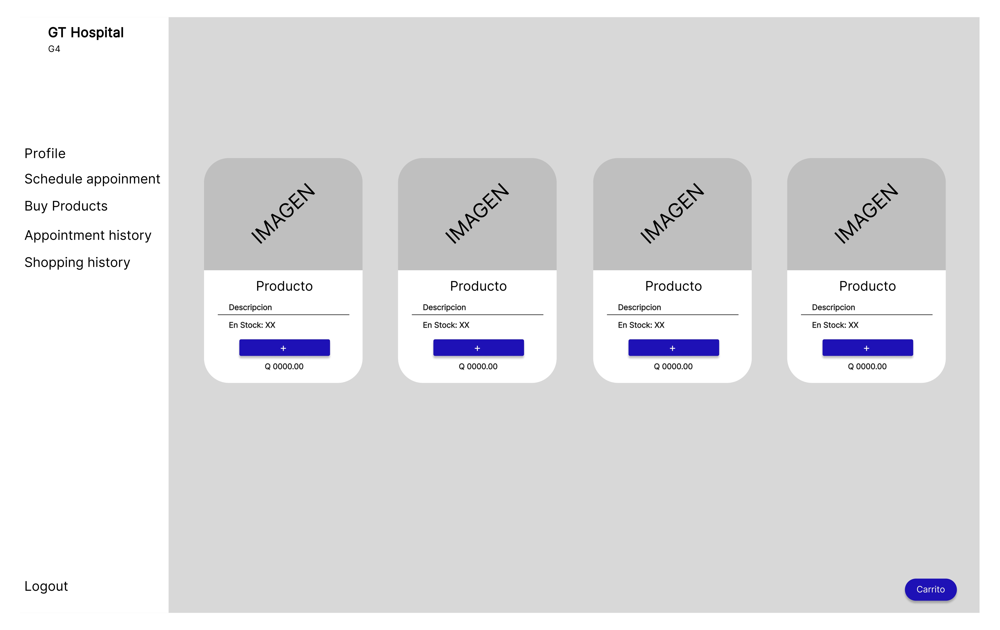
### Carrito de Compras
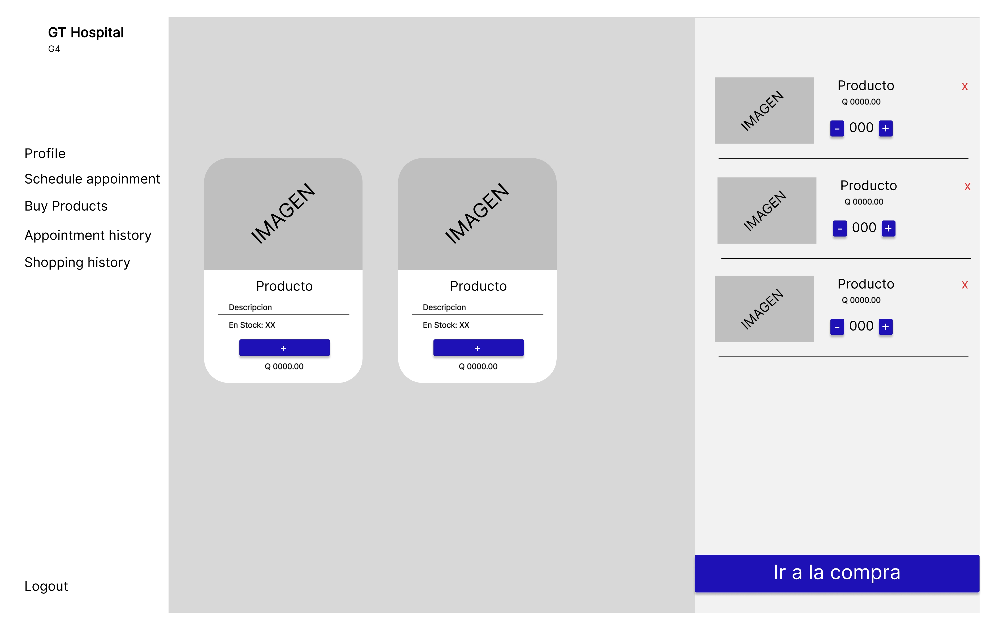
### Total de la Compra
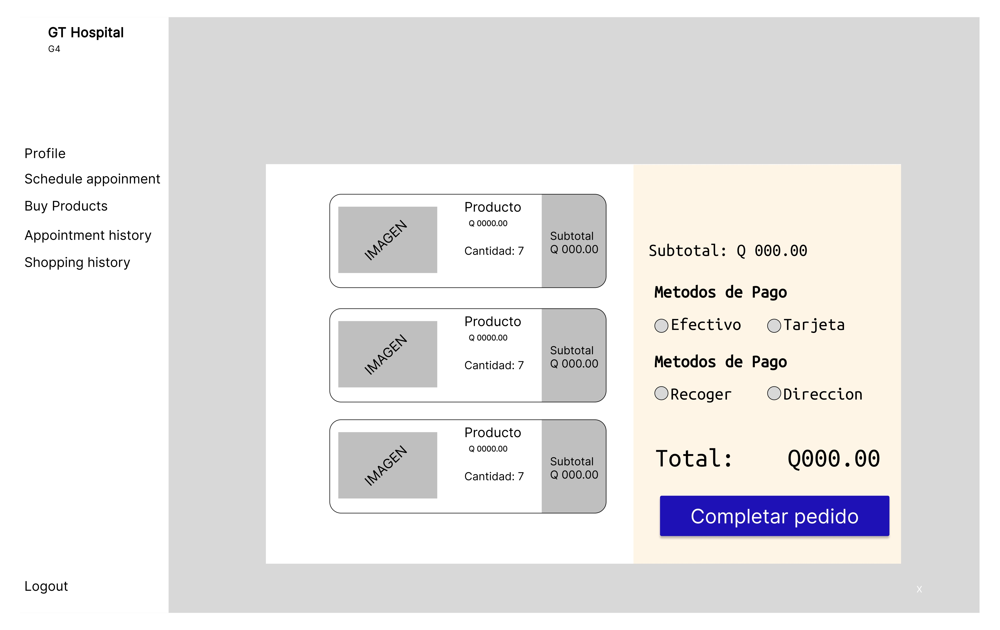
### Historial de Compras
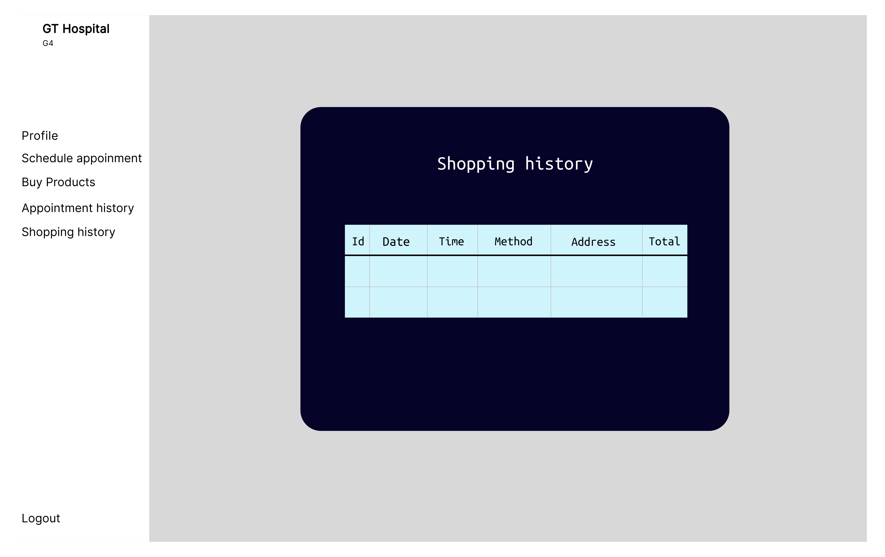

