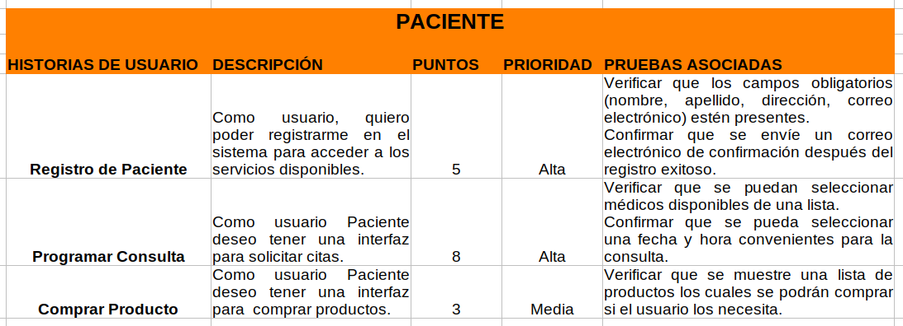

# Proyecto 1 Fase 1 Grupo 4 AyD2

# Manual Tecnico

* Esteban Humberto Valdez Ennati        - 202011535
* Luis Angel Barrera Velásquez          - 202010223
* Josué Rodolfo Morales Castillo        - 202010033
* Ayeser Cristian Oxlaj Juarez          - 202010025
* Juan Pablo García Ceballos            - 201901598

## Diagrama Inicial del Diseño Arquitectónico

## Diagramas de patrones Utilizados 
### Singleton: 

## Builder

## Strategy

## Diagrama Entidad Relación mejorado

## Endpoints y su descripcion
| Endpoint                              | Descripción                                                                                             |
|---------------------------------------|---------------------------------------------------------------------------------------------------------|
| /adduser                              | Permite registrar nuevos usuarios, ya sea individualmente o mediante carga masiva.                     |
| /login                                | Permite a los usuarios iniciar sesión proporcionando su correo electrónico y contraseña.              |
| /forgotPassword                       | Envía un código de verificación al correo electrónico del usuario para restablecer la contraseña.      |
| /confirmPasswordReset                 | Permite confirmar el restablecimiento de la contraseña utilizando el código de verificación.          |
| /addCita                              | Permite agregar una cita médica para un usuario específico.                                             |
| /cancelCita                           | Permite cancelar una cita médica previamente agendada.                                                  |
| /getCitas/id_user                     | Obtiene la lista de citas médicas asociadas a un usuario específico.                                     |
| /getCitasEsperando/id_user            | Obtiene la lista de citas médicas en espera para un usuario específico.                                  |
| /agendarCita                          | Permite a un usuario agendar una cita médica previamente en espera.                                      |
| /getCitasDoctor/:id_user_doctor       | Obtiene la lista de citas médicas agendadas para un doctor específico.                                   |
| /atenderCita                          | Permite a un doctor marcar una cita médica como atendida.                                                |
| /products/:id_user                    | Obtiene la lista de productos asociados a un usuario específico.                                         |
| /comprar                              | Permite a un usuario realizar una compra de productos, ya sea mediante tarjeta de crédito o en efectivo.|
| /updateUser                           | Permite actualizar el perfil de un usuario, incluyendo su información personal y contraseña.           |
| /updateProduct/:id_product           | Permite actualizar la información de un producto específico.                                             |
| /getReportes/:id_user                 | Obtiene varios informes relacionados con usuarios, doctores y productos para un usuario específico.    |

## Historias de Usuario

